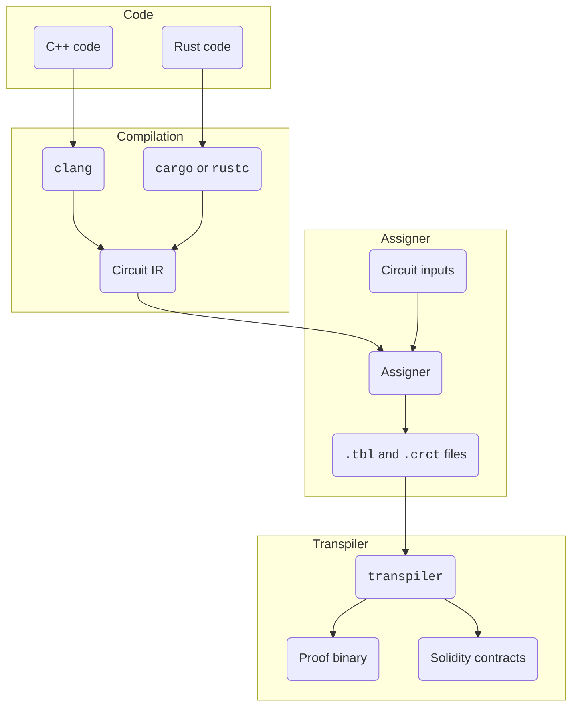

import Tabs from '@theme/Tabs'
import TabItem from '@theme/TabItem'

# Compiling a circuit

This tutorial contains step-by-step instructions on how to compile the [**arithmetic circuit created previously**](./writing-a-simple-circuit).

There are two possible ways for transforming a circuit into a proof binary and Solidity code.

- By calling individual tools
- By using [**the zkllvm-template project**](https://github.com/NilFoundation/zkllvm-template)

## Calling individual tools

The following diagram shows the flow for converting a `.cpp` or a `.rs` file into a proof binary and Solidity code for deployment.



Complete the below steps to follow this flow.

### Running the compiler

To generate the circuit IR, do the following.

<Tabs groupId='language'>
  <TabItem value='cpp' label='C++'>

    For a pre-built binary installation of `clang`:

    ```bash
    clang-zkllvm -S -emit-llvm  path/to/circuit.cpp
    ```

    For a `clang` installation from sources:

    ```bash
    $CLANG_ZKLLVM -S -emit-llvm  path/to/circuit.cpp
    ```

    , where `$CLANG_ZKLLVM` is the `clang` binary built during the installation.

  </TabItem>

  <TabItem value='rust' label='Rust'>

    For a pre-built binary installation of `rustc`:

    ```bash
    rustc +zkllvm --target assigner-unknown-unknown --emit=llvm-ir multiplication_example.rs -C opt-level=3
    ```

    Or for a pre-built binary installation of `cargo`:

    ```bash
    cargo +zkllvm build --target assigner-unknown-unknown
    ```

    For an installation of `rustc` from sources:

    ```bash
    $RUSTC --target assigner-unknown-unknown --emit=llvm-ir multiplication_example.rs -C opt-level=3
    ```

    Or for an installation of `cargo` and `rustc` from sources:

    ```bash
    RUSTC=$RUSTC $CARGO build --target assigner-unknown-unknown --release
    ```

    , where `$RUSTC` and `$CARGO` are binaries built during [**installation**](../getting-started/installation).

    The `-C opt-level=3` option is needed to build the circuit into an IR that is most compatible with `assigner`. If it is ommitted, the IR will contain additional verbose code which may hinder `assigner` from generating constraints and the assignment table.

  </TabItem>
</Tabs>

### Passing the IR to `assigner`

At this stage, the newly generated IR and the public info file are ready to be passed to `assigner`.

Run the following command to generate the circuit constraints and the assignment table.

```bash
assigner -b circuit.ll -i ../inputs/public_input.inp -c circuit.crct -t assignment.tbl -e pallas --generate-type circuit-assignment
```

### Using `transpiler` to generate the circuit proof

The `.crct` and `.tbl` files can be passed to the `transpiler` tool to generate a binary with the proof and Solidity files containing the circuit.

Run the below command to generate `proof.bin`.

```bash
transpiler -m gen-test-proof -c circuit.crct -t assignment.tbl -o output -e pallas
```

Execute the following command to produce Solidity files.

```bash
transpiler -m gen-evm-verifier -c circuit.crct -t assignment.tbl -o output -e pallas --optimize-gates
```

Congratulations! At this stage, we recommend taking a look at other examples in the zkLLVM repository and compiling them.

## Using `zkllvm-template`

[**`zkllvm-template` is a project**](https://github.com/NilFoundation/zkllvm-template) designed to simplify working with complex circuits and zk-enabled apps.

To work with `zkllvm-template`, clone its repository with all sub-modules.

```bash
git clone --recurse-submodules https://github.com/NilFoundation/zkllvm-template.git
cd zkllvm-template
```

Additionally, [**install all required tools**](./installation) from pre-built binaries.

Within `zkllvm-template`, the `./main` folder contains the `main.cpp` file that acts as the entry point for the `clang` compiler.

To run the compiler, execute the following command.

```bash
scripts/run.sh
```

This is equivalent to completing each individual step described in the previous section.

