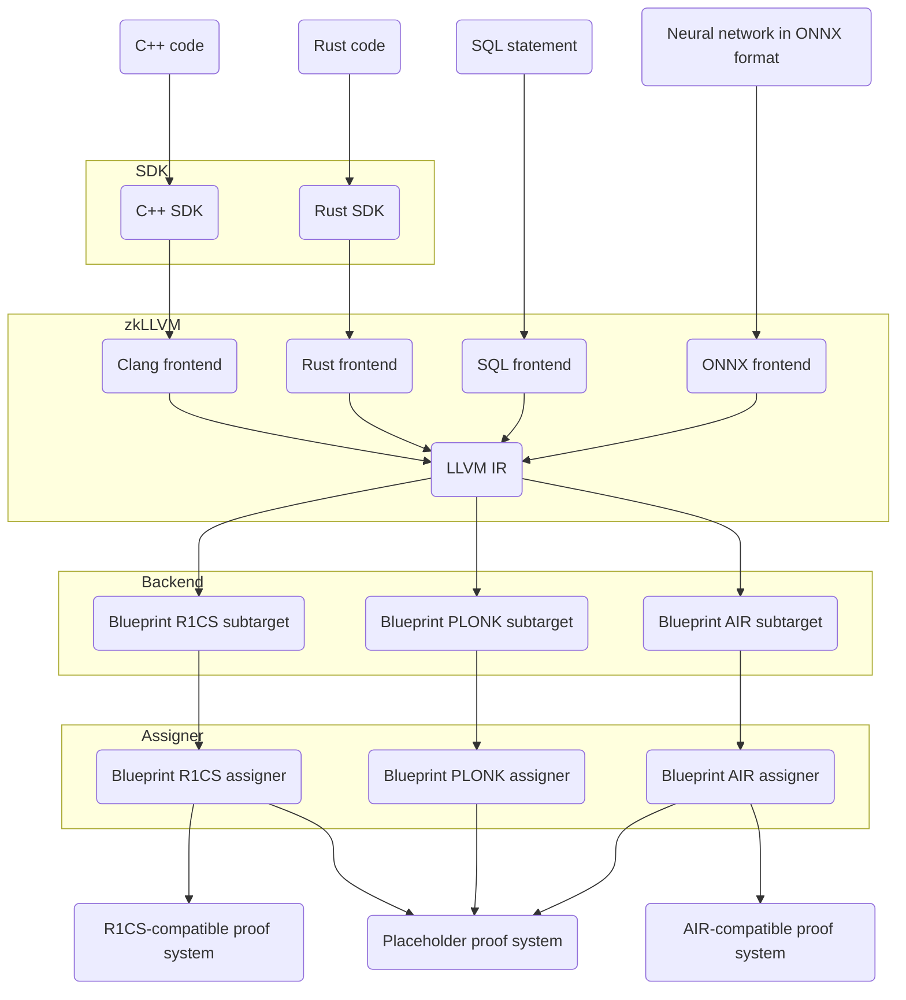

import GitHubButton from '@site/src/components/GitHubButton'

# What is zkLLVM?

## Definition

<GitHubButton Url='https://github.com/NilFoundation/zkllvm' />

zkLLVM is a compiler that transforms C++ or Rust code into a circuit to be used in zk-SNARK or zk-STARK systems.

The goal of zkLLVM is to make zero-knowledge proofs and provably computations accessible for everyone with knowledge of C++ or Rust programming.

zkLLVM takes code, breaks it down into circuit components, and transforms it into an arithmetic constraint system that can be used to generate and verify proofs when given public and private inputs.

Circuits generated by zkLLVM are compatible with the [**Placeholder proof system**](https://nil.foundation/blog/post/placeholder-proofsystem) and support of additional proof systems is in development.

:::info[Proof system]

The Placeholder system is PLONKish. The circuit components for this system are supplied from =nil; Foundation's [**blueprint library**](https://github.com/NilFoundation/zkllvm-blueprint).

:::

## Pipeline

### Overview

The following diagram outlines the key tools and stages of the zkLLVM circuit generation pipeline.

### Step-by-step

Working with zkLLVM involves the following steps.

#### Write the code in C++ or Rust

There is no need to use any special syntax when working with zkLLVM. A circuit is defined by simply adding a `[[circuit]]` directive before a function. Any existing C++ or Rust code is reusable for zkLLVM.

:::tip[Examples]

The [**zkLLVM repository**](https://github.com/NilFoundation/zkllvm) contains several ready-made examples of circuits. They can be reused wholly or repurposed depending on the use case.

:::

#### Compile the code into a circuit

Compiling takes only a few seconds and the entire process is done via a CLI tool which is a replacement for `clang` and `rustc`. This tool can be easily integrated to a CI/CD pipeline or any development environment.

#### Pass the circuit to the `assigner` tool

The `assigner` tool is used to prepare all inputs and witnesses for the circuit.

After this stage is complete, the circuit should be ready for use with dynamic inputs.
