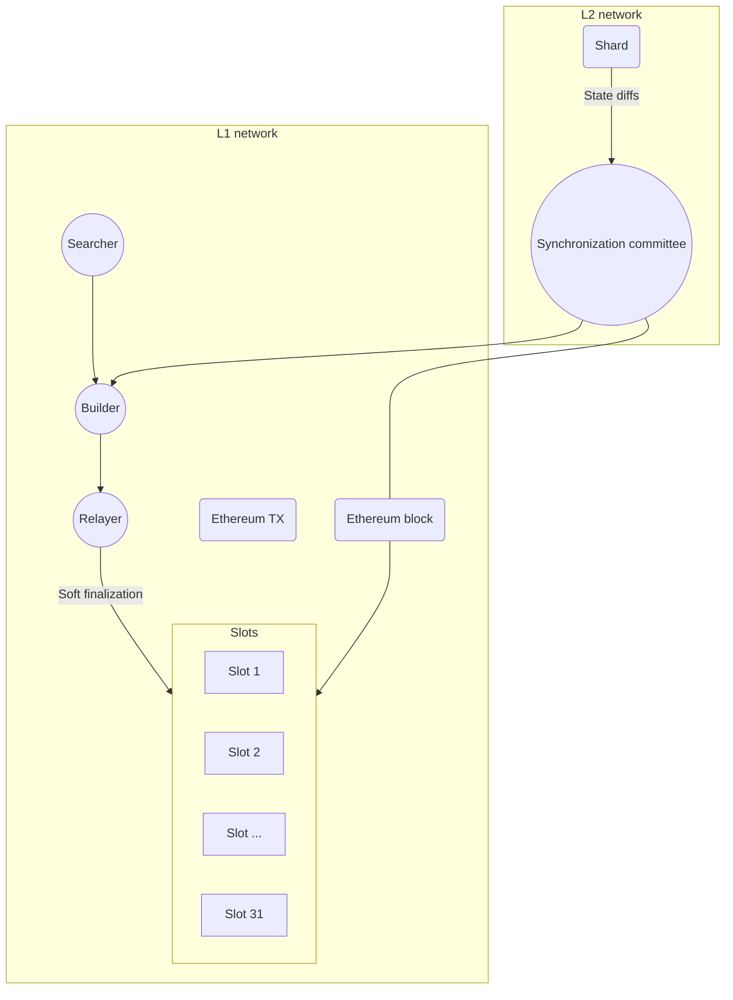

# Data availability

## Definition

In =nil;, data availability (DA) is ensured via the following methods:

* L2 submits DA transactions to Ethereum with the process governed by a dedicated committee
* The consensus shard also submits snapshots of the global state via state diffs

## DA transactions

### The synchronization committee

Ensuring the availability of L2 data is delegated to the syncronization committee.

Any validator can opt in to be a member of the synchronization committee. When a validator joins the committee, they automatically stop being an active validator so that their stake can only be slashed for one role at a given time. This is enforced by the committee election algorithm.

:::info[Committee rotation]

The synchronization committee operates for one epoch (the duration of epochs is determined by the protocol parameters). A new committee is chosen when a new epoch begins.

:::

:::info[Protocol]

The protocol of the syncronization committee is operated through an application deployed on top of the consensus shard.

:::

### The algorithm

The basic algorithm of how the synchronization committee operates is as follows.

1. The synchronization committee generates a state difference for a shard between time $T$ and time $T + p$
2. A pre-selected node proposes a hash of the state difference
3. The synchronization committee votes on the hash
4. If the hash attains $2/3 + 1$ votes, the hash, the state difference, and the aggregate signature are composed into an Ethereum DA transaction sent via the consensus shard
5. If the hash attains $1/3$ votes against it, the syncronization committee leader is slashed

If there are sufficient transactions, the synchronization committee can compose them into an L1 block. This includes the block in the nearest L1 epoch slot (which achieves soft finality faster) and allows the block to participate in relay auctions. This case is shown in the following diagram.



If there are too few DA or state-proof transactions, the synchronization committee can decide to send them directly to builders and searchers as a bundle.

## Impact on transaction costs

This sub-section estimates the cost of a data availability transaction given the following considerations:

* The DA transaction primarily consists of state roots of the submissions made by execution shards to the consensus shard
* The consensus shard submits its snapshot every three (3) seconds, which is exactly half of the current Ethereum slot time
* Every execution shard transaction results in a change to its account nonce (32 bytes), account balance (32 bytes), and storage (32 bytes state root hash)

The calculation also makes the following assumptions:

* There are 400 execution shards which achieve the target of 60,000 transactions per second
* The average depth of the Merkle State Trie path is three (3)

:::tip[Justification]

The probability of choosing three identical three-byte prefixes for 400 keys (shards) is 0.475% which is considered as the worst case scenario.

:::

The total data size (in bytes) for a DA transaction is calculated as follows:

$$
size = shards * (nonce + storage + balance + merkle_path) = 400 * 32 * 6 = 76800
$$

:::info

The calculation discards the sizes of metadata and aggregate committee signatures as they are relatively small.

:::

The ratio of zeros to non-zeros in the data packet is estimated at $1/256$. The total cost of a DA transaction is calculated as follows.

$$
Gas_{zero} = 1 / 256 * 76800 * 4(gas_cost) = 1200
$$

$$
Gas_{non-zero} = 255 / 256 * 76800 * 16(gas_cost) = 1224000
$$

$$
Gas_{total} = Gas_{zero} + Gas_{non-zero} = 1225200
$$

Assuming that ETH is $2900 and gas price is 15 gwei, the cost of a DA transaction is $53.2962.

:::info

The calculation above does not account for the period between diffs. This omission is justified given that changes always affect the same accounts, the commitment size of the diffs remains consistent.

If the calculation accounted for periods and additional transactions, the additional cost per user transaction would be calculated as follows.

$$
1225200 / (6 * 60000) = 3.403 gas
$$

If state diff submissions are made at the same interval as DA transactions, the cost would be six times higher ($0.00084).

:::

## Consensus shard snapshots

The consensus shard periodically transmits global state diffs to Ethereum. These state diffs contain all L2 transactions applied to the previous state, allowing L1 to reconstruct the full L2 state when needed.

### L1 data storage

A dedicated smart contract deployed on L1 is responsible for accepting state diffs from L2, verifying signatures, and ensuring the persistent storage of data on-chain. 

State diffs from the consensus shard are stored in the Ethereum *calldata*. Metadata is stored as a sequential chain with the following mapping:

```bash
head: hash32;
mapping (hash32 => struct) {
    signature : hash32,
    da_hash : hash32,
    period : uint32 (>= 1),
    prev_da : hash32,
    zk_proof_hash : hash32,
    zk_verification_passed : bool
}
```

Here are the definitions of the key fields in the mapping:

* `da_hash` The hash of the current data availability transaction
* `period` The number of consolidated blocks. This number is defined by the protocol parameters and is, therefore, specified explicitly
* `prev_da` The hash of the previous data availability transaction
* `zk_proof_hash` The hash of the state transition proof
* `zk_verification_passed` The current verification status

`da_hash`, `prev_da`, and `zk_proof_hash` all act as the means for navigating state diffs in the *calldata*.

## Execution shards

There are no specific requirements for how DA is handled at the level of execution shards.

Execution shards are recommended to follow best practices, namely storing snapshots on a reliable off-chain platform. Compressed state diffs can be sent to Ethereum (via *calldata* or via [**EIP-4844**](https://www.eip4844.com/)) or to a dedicated DA layer.