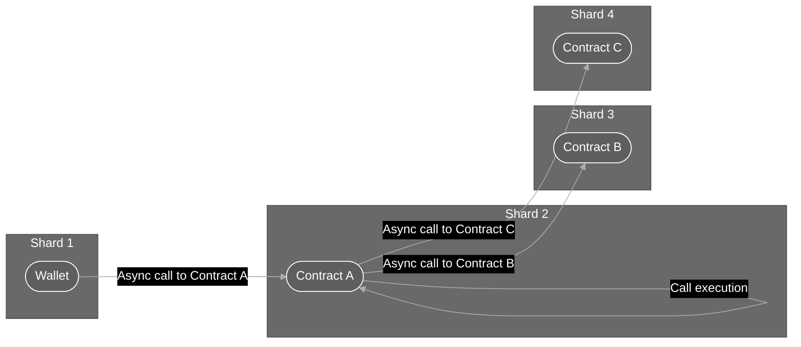
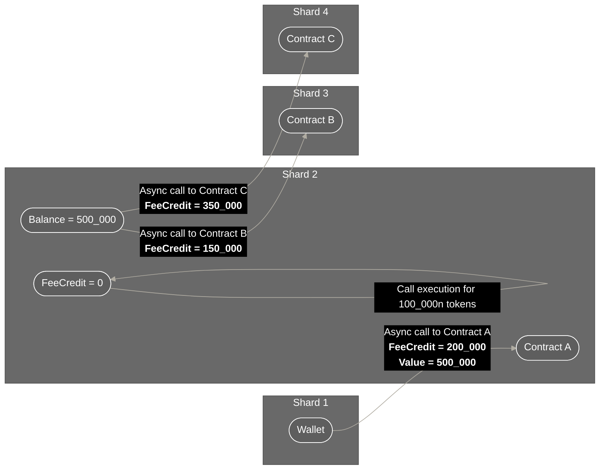
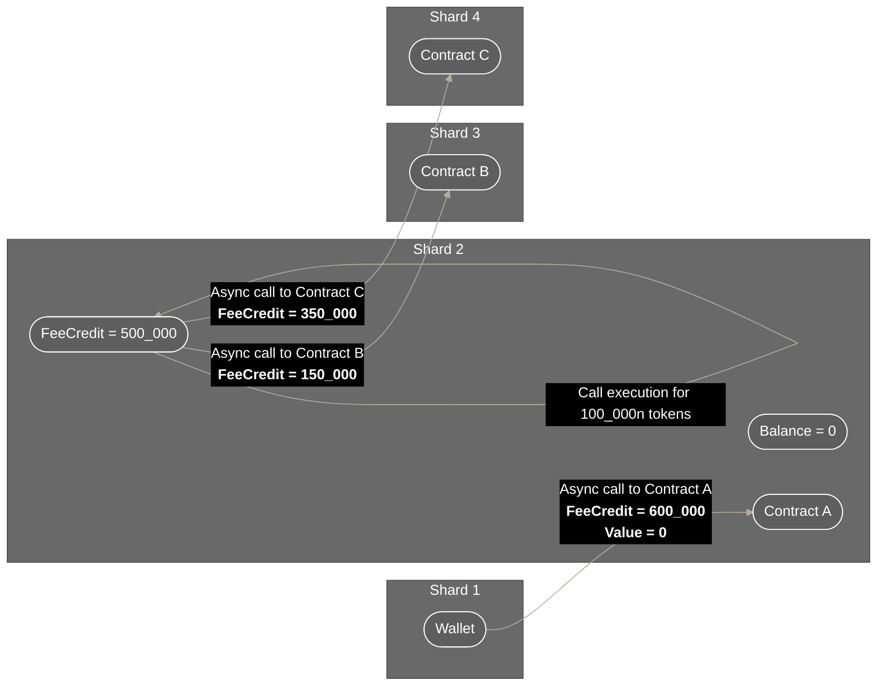
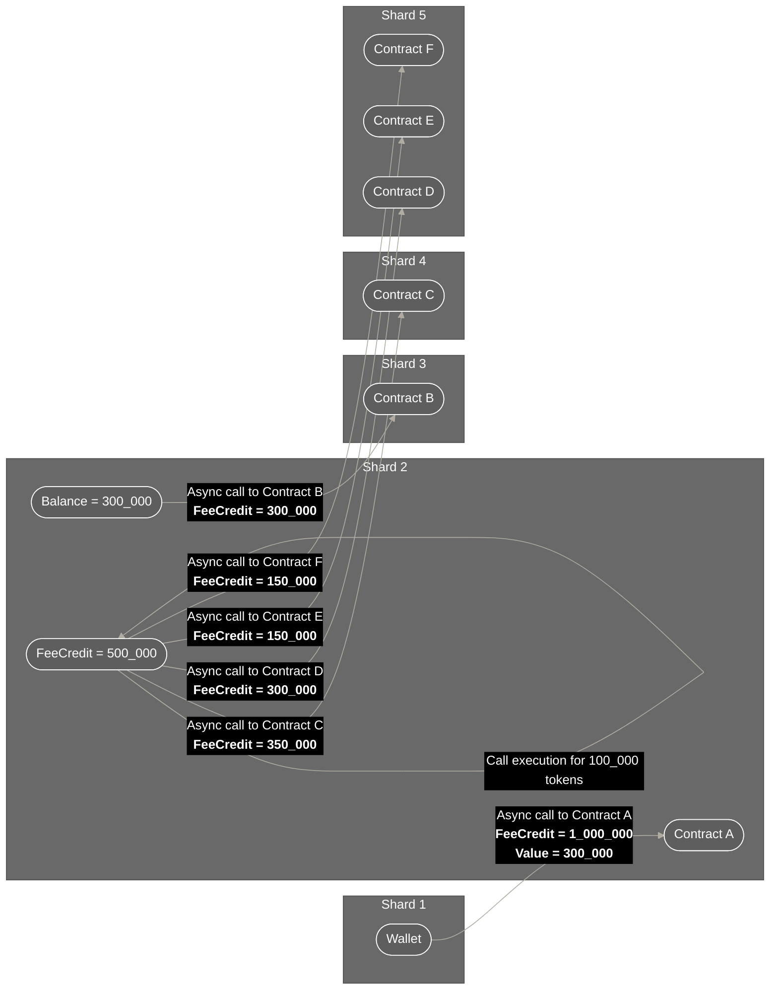

# Gas and value

This tutorial defines how =nil; treats gas and message value. 

## Definition 

In nil;, every message has two fields responsible for handling gas and value:

* `FeeCredit`
* `Value`

`FeeCredit` contains the amount of =nil; base tokens to be paid for message execution. This is different from regular Ethereum in that there is no base fee or the premium fee. Instead, `FeeCredit` is the gas limit (the maximum possible amount of gas the message sender is willing to pay) multiplied by the possible gas price within a specific shard.

:::info

`FeeCredit` is an estimate created by the message sender rather than a precisely calculated message execution fee. To evaluate whether a given fee credit would be enough to make a call, use the `nil wallet estimate-fee ADDRESS FUNC_NAME [ARGS]` command.

To estimate gas in a different way, use the `eth_estimateFee` JSON-RPC method or the `nil wallet call-readonly ADDRESS` command while providing the `--with-details` flag. Note that this command may sometimes produce the `"out of gas"` response which should not be considered an error.

:::

`Value` is the amount of tokens to be transferred to the address where the message is sent. These tokens are not used for message execution and, instead, are debited to the receiving address.

:::info

If a message is made to a non-payable function, and `Value` is not zero, execution will be reverted as the contract will not be able to accept the transferred tokens. 

:::

## Basic example

This Nil.js example sends a message from the user's wallet to another contract. It estimates the gas price to be `10n` and is willing to pay for a maximum of `100_000n` units of gas. 

```typescript showLineNumbers
const hash = await wallet.sendMessage({
  to: CONTRACT_ADDRESS,
  value: 0n,
  bounceTo: BOUNCE_ADDRESS,
  feeCredit: 100_000n * 10n,
  data: encodeFunctionData({
    abi: CONTRACT_ABI,
    functionName: "func_name()",
    args: [ARGS],
  }),
});
```

If the receiver contract has a payable function, the wallet would be able to send the following message.

```typescript showLineNumbers
const hash = await wallet.sendMessage({
  to: CONTRACT_ADDRESS,
  value: 5_000_000n,
  bounceTo: BOUNCE_ADDRESS,
  feeCredit: 100_000n * 10n,
  data: encodeFunctionData({
    abi: CONTRACT_ABI,
    functionName: "payable_func_name()",
    args: [ARGS],
  }),
});
```

## Gas forwarding

Gas forwarding applies to cases where an async call to one contract triggers a chain of async calls to other contracts:



Consider this flow:

* The wallet sets `FeeCredit` to `500_000` and asynchronously calls Contract A
* The message is executed for `200_000`, leaving `300_000` tokens unused
* As part of executing the initial message from the wallet, Contract A must send async calls to Contract B and Contract C requiring at least `150_000` and `350_000` `FeeCredit`, respectively
* Contract A must decide how it will pay for these calls

=nil; provides five possible options on how Contract A can handle forwarding tokens for executing subsequent calls. These options are set via the `uint8 forwardKind` argument when using `asyncCall()`:

```solidity showLineNumbers
function asyncCall(
    ...
    address bounceTo,
    uint feeCredit,
    uint8 forwardKind,
    ...
)
```

### No gas forwarding

The wallet can set some `FeeCredit` and send some tokens to Contract A:



In the above flow:

* The wallet sets `FeeCredit` to `200_000` and asynchronously calls Contract A. The wallet also sends `500_000` tokens as `Value`
* The message is executed for `100_000`, leaving another `100_000` of `FeeCredit` available
* Instead of forwarding the leftover `FeeCredit`, Contract A pays for async calls to Contract B and Contract C from its balance

This is how Contract A calls Contract B:

```solidity showLineNumbers
function callContractB(
    Nil.asyncCall(
        CONTRACT_B_ADDRESS,
        ...
        150000,
        Nil.FORWARD_NONE,
        ...
    );
)
```

And Contract C:

```solidity showLineNumbers
function callContractC(
    Nil.asyncCall(
        CONTRACT_C_ADDRESS,
        ...
        350000,
        Nil.FORWARD_NONE,
        ...
    );
)
```

### Forwarding by absolute value

The wallet only sets `FeeCredit` and does not send any tokens to Contract A:



In the above flow:

* The wallet sets `FeeCredit` to `600_000` and asynchronously calls Contract A. No tokens are sent to Contract A directly
* The message is executed for `100_000`, leaving another `500_000` of `FeeCredit` available
* Contract A forwards the leftover `FeeCredit` to pay for execution of Contract B (`150_000`) and Contract C (`350_000`)

Here is how Contract A calls Contract B:

```solidity showLineNumbers
function callContractB(
    Nil.asyncCall(
        CONTRACT_B_ADDRESS,
        ...
        150000,
        Nil.FORWARD_VALUE,
        ...
    );
)
```

And Contract C:

```solidity showLineNumbers
function callContractC(
    Nil.asyncCall(
        CONTRACT_C_ADDRESS,
        ...
        350000,
        Nil.FORWARD_VALUE,
        ...
    );
)
```

### Forwarding by percentage

Similarly to forwarding by value, the wallet only sets `FeeCredit` and does not send any tokens to Contract A:


The basic flow is also similar to forwarding by value:

* The wallet sets `FeeCredit` to `600_000` and asynchronously calls Contract A. No tokens are sent to Contract A directly
* The message is executed for `100_000`, leaving another `500_000` of `FeeCredit` available
* Contract A forwards the leftover `FeeCredit` to pay for execution of Contract B (`150_000`) and Contract C (`500_000`)

There is one major difference between forwarding by percentage and forwarding by value, and it is in how Contract A calls other contracts. Contract B:

```solidity showLineNumbers
function callContractB(
    Nil.asyncCall(
        CONTRACT_B_ADDRESS,
        ...
        30,
        Nil.FORWARD_PERCENTAGE,
        ...
    );
)
```

Contract C:

```solidity showLineNumbers
function callContractC(
    Nil.asyncCall(
        CONTRACT_C_ADDRESS,
        ...
        70,
        Nil.FORWARD_PERCENTAGE,
        ...
    );
)
```

Instead of specifying absolute values in the `feeCredit` argument, Contract A sets percentages of the leftover `FeeCredit` it sends to Contract B and Contract C.

### Forwarding by equal split

:::info

Forwarding by equal split is the default option if the `forwardKind` argument is not specified when calling `asyncCall()`.

:::

The wallet only sets `FeeCredit` and does not send any tokens to Contract A:


In the above flow:

* The wallet sets `FeeCredit` to `600_000` and asynchronously calls Contract A. No tokens are sent to Contract A directly
* The message is executed for `100_000`, leaving another `500_000` of `FeeCredit` available
* Contract A forwards the leftover `FeeCredit` to pay for execution of Contract B (`250_000`) and Contract C (`250_000`)

Note that Contract A splits the leftover `FeeCredit` equally between Contract B and Contract C. Here is how it calls Contract B:

```solidity showLineNumbers
function callContractB(
    Nil.asyncCall(
        CONTRACT_B_ADDRESS,
        ...
        Nil.FORWARD_REMAINING,
        ...
    );
)
```

Contract C:

```solidity showLineNumbers
function callContractC(
    Nil.asyncCall(
        CONTRACT_C_ADDRESS,
        ...
        Nil.FORWARD_PERCENTAGE,
        ...
    );
)
```

The `feeCredit` argument is not specified in both uses of `asyncCall()`. As `FORWARD_PERCENTAGE` is the default option, it can be omitted as well.

### Mixed forwarding

Contract A can also specify several different types of forwarding when calling other contracts:



In the above flow:

* The wallet sets `FeeCredit` to `1_000_000` and asynchronously calls Contract A. The wallet also sends `300_000` to the balance of Contract A
* The message is executed for `100_000`, leaving another `900_000` of `FeeCredit` available
* Contract A sends its balance to pay for execution of Contract B (`300_000`), no gas is forwarded
* Contract A forwards some of its leftover gas to pay for execution of Contract C (`350_000`), gas is forwarded by absolute value
* Contract A forwards some of its leftover gas to pay for the execution of Contract D (`300_000`), gas is forwarded by percentage
* Contract A forwards the remaining gas by equal split to Contract E and Contract F

:::info[Order of forwarding]

When value and percentage forwarding are used in mixed forwarding, value forwarding calculated first. For example, if there is `900_000` leftover `FeeCredit` and `300_000` is forwarded by value to other contracts while 30% is forwarded by percentage, thia 30% would equal `200_000` instead of `300_000`. 

Conversely, equal split forwarding is always calculated last. In the above example, only `400_000` leftover `FeeCredit` will be left after calculating value and percentage forwarding. This amount will be split equally among the remaining contracts to be called.

:::

Here is how Contract A calls Contract B:

```solidity showLineNumbers
function callContractB(
    Nil.asyncCall(
        CONTRACT_B_ADDRESS,
        ...
        300000,
        Nil.FORWARD_NONE,
        ...
    );
)
```

Contract C:

```solidity showLineNumbers
function callContractC(
    Nil.asyncCall(
        CONTRACT_C_ADDRESS,
        ...
        350000,
        Nil.FORWARD_VALUE,
        ...
    );
)
```

Contract D:

```solidity showLineNumbers
function callContractD(
    Nil.asyncCall(
        CONTRACT_D_ADDRESS,
        ...
        30,
        Nil.FORWARD_PERCENTAGE,
        ...
    );
)
```

Contract E:

```solidity showLineNumbers
function callContractE(
    Nil.asyncCall(
        CONTRACT_E_ADDRESS,
        ...
        Nil.FORWARD_REMAINING,
        ...
    );
)
```

Contract F:

```solidity showLineNumbers
function callContractF(
    Nil.asyncCall(
        CONTRACT_F_ADDRESS,
        ...
        Nil.FORWARD_REMAINING,
        ...
    );
)
```


