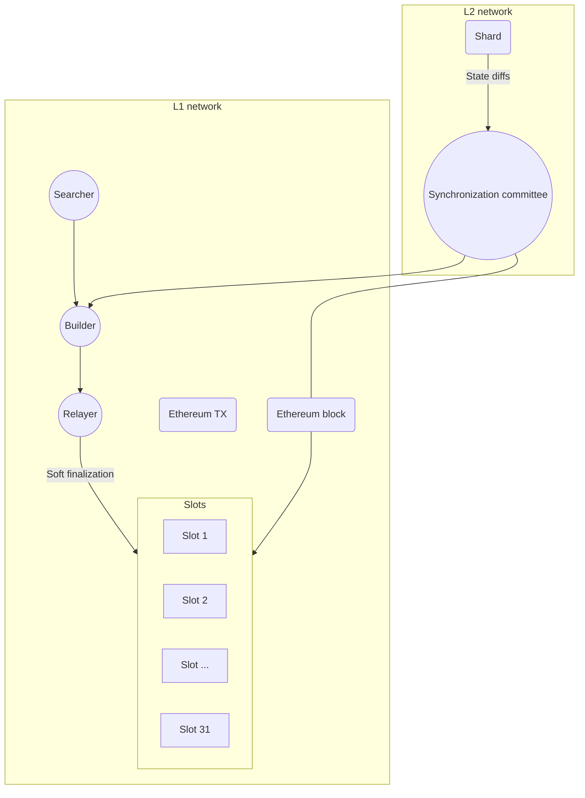

# Data availability

## Definition

In =nil;, data availability (DA) is ensured via the following methods:

* The synchronization committee (operating on top of the consensus shard) submits DA transactions to Ethereum
* The consensus shard submits snapshots of the global state as state diffs to Ethereum  

## DA transactions

### The synchronization committee

The synchronization committee ensures that the cluster posts the necessary data to Ethereum.

Any validator can opt in to be a member of the synchronization committee. When a validator joins the committee, they automatically stop being an active validator so that their stake can only be slashed for one role at a given time. This is enforced by the committee election algorithm.

:::info[Committee rotation]

The synchronization committee operates for one epoch (the duration of epochs is determined by the protocol parameters). A new committee is chosen when a new epoch begins.

:::

:::info[Protocol]

The protocol of the synchronization committee is operated through an application deployed on top of the consensus shard.

:::

### The algorithm

The basic algorithm of how the synchronization committee operates is as follows.

1. The synchronization committee generates a state difference for a shard between time $T$ and time $T + p$
2. A pre-selected node proposes a hash of the state difference
3. The synchronization committee votes on the hash
4. If the hash attains $2/3 + 1$ votes, the hash, the state difference, and the aggregate signature are composed into an Ethereum DA transaction and the transaction is sent to L1
5. If the hash attains $1/3$ votes against it, the synchronization committee leader is slashed

If there are sufficient transactions, the synchronization committee can compose them into an L1 block. This includes the block in the nearest L1 epoch slot (which achieves soft finality faster) and allows the block to participate in relay auctions. This case is shown in the following diagram.



If there are too few DA or state-proof transactions, the synchronization committee can decide to send them directly to L1 builders and searchers as a bundle.

## Consensus shard snapshots

The consensus shard periodically transmits global state diffs to Ethereum. These state diffs contain all transactions applied to the previous state, thus allowing Ethereum to offer full data availability guarantees for the consensus shard.

### L1 data storage

A dedicated smart contract deployed on L1 is responsible for accepting state diffs from L2, verifying signatures, and ensuring the persistent storage of data on-chain. 

State diffs from the consensus shard are stored in the Ethereum *calldata*. Metadata is stored as a sequential chain with the following mapping:

```bash
head: hash32;
mapping (hash32 => struct) {
    signature : hash32,
    da_hash : hash32,
    period : uint32 (>= 1),
    prev_da : hash32,
    zk_proof_hash : hash32,
    zk_verification_passed : bool
}
```

Here are the definitions of the key fields in the mapping:

* `da_hash` The hash of the current data availability transaction
* `period` The number of consolidated blocks. This number is defined by the protocol parameters and is, therefore, specified explicitly
* `prev_da` The hash of the previous data availability transaction
* `zk_proof_hash` The hash of the state transition proof
* `zk_verification_passed` The current verification status

`da_hash`, `prev_da`, and `zk_proof_hash` all act as the means for navigating state diffs in the *calldata*.

## Execution shards

There are no specific requirements for how DA is handled at the level of execution shards.

Execution shards are recommended to follow best practices, namely storing snapshots on a reliable off-chain platform. Compressed state diffs can be sent to Ethereum (via *calldata* or via [**EIP-4844**](https://www.eip4844.com/)) or to a dedicated DA layer.