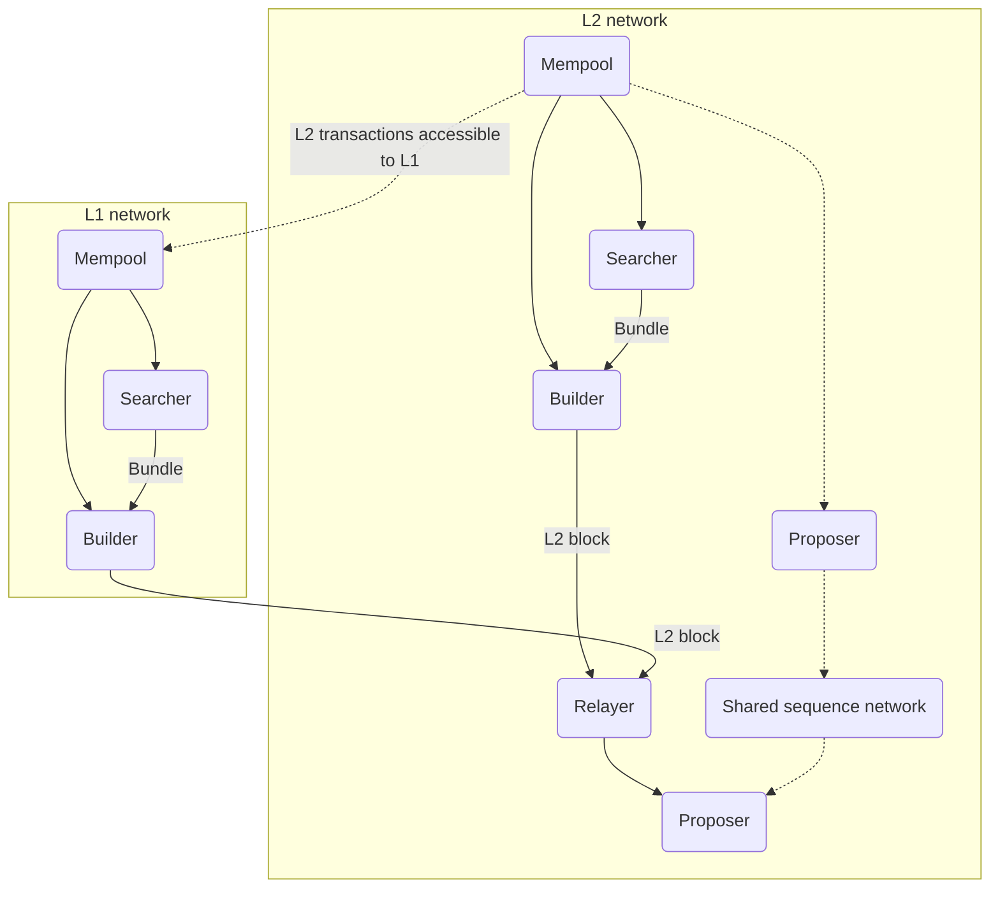

# Sequencing

## Definition

=nil; plans to adopt the proposer-builder separation (PBS) model whose key principle will be in building a network of builders and searchers competing for maximum extractable value (MEV) in relay auctions.

:::tip[Justification]

The sequencing structure of =nil; is planned to be fully compatible with Ethereum, enabling builders and searchers from L1 to easily participate in =nil;. This boosts protocol stability and liveness without sacrificing sovereignty.

:::

## Sequencing at the execution shard level

PBS participants can freely choose the shard that they want to interact with. 

While there exists a theoretical risk of nodes deciding to only partner with shards that host high-gain dApps (such as decentralized exchanges), this risk is negligible for two reasons.

As the number of effective builders in a shard grows, the chances of attaining rewards for participants decreases:

$$
E(G) = 1/n * p
$$

, where $n$ is the number of effective builders, and $p$ is the expected gain.

:::info[Example]

Consider another shard where the competition is less intense and $k$ is the expected gain so that: 

$$
n \lt p/k
$$

Despite the gain itself being lower, the chances of attaining it are higher in this shard compared to the highly competitive shard described previously.

$$
E(G_k) \gt E(G_n)
$$

:::

As a result, market mechanics should drive participants to partner with less competitive shards to increase their chances of attaining rewards.

### Using independent sequencers

The architecture of =nil; also allows for using independent sequencers in different shards.

:::tip[Use case]

Using a custom sequencer to decrease MEV in a shard with a decentralized exchange could reduce slippage (but increase transaction costs).

:::

Consult the below diagram for an illustration of using an independent sequencer.

## Sequencing at the consensus shard level

By definition, the consensus shard has stricter requirements for speed and liveness when compared to execution shards.

In the consensus shard, proposers construct and verify blocks, eliminating any middlemen. 

:::tip[Justification]

There are several reasons dictating why the consensus shard follows a distinct approach to sequencing.

* Lack of MEV issues: at the consensus shard level, there is no additional value to be extracted from sequencing.
* No competition for gas prices: there are few incentives for proposers to optimize costs.
* If the number of execution shards is low, gas capacity may be underutilized.

:::

In the consensus shard, transaction costs are covered by the protocol fee. Gas prices are derived directly from the market price.