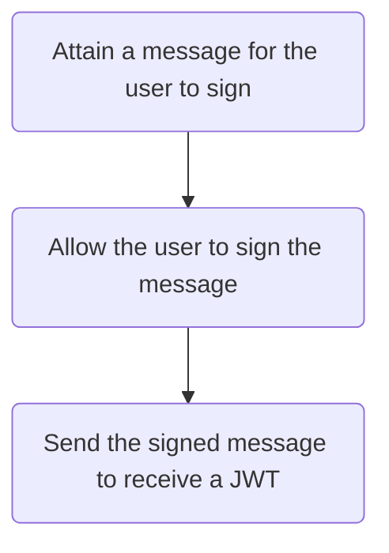

import ApiSchema from '@theme/ApiSchema';

# Signing up

This tutorial showcases how authorization works in Proof Market and its API.

:::info

Authorization inside Proof Market requires an ETH wallet that can use its private key to sign messages.

:::

## Overview

The below diagram shows the flow for authorizing a new user inside Proof Market.

:::tip[Justification]

The sign up flow ensures security while allowing Proof Market usage for anyone with an ETH wallet. When an initial request is made, Proof Market issues a random message that the user can sign off-chain with any method of their choice without exposing their private key. The request for a JWT only requires the account address and the signed message.

:::

## Performing the initial request

First, send a [**`GET` request to the `/user/metamask/message`**](../../api-reference#operation/MetamaskAuthMessage) endpoint to produce the following response.

<ApiSchema pointer="#/components/schemas/MetamaskAuthMessage"/>

## Signing the message

At this point, the user needs to sign the message contained in the `"msg"` key received during the previous request.

Depending on the implementation, any application can add this functionality by using [**the `eth_sign` or the `personal_sign` methods**](https://docs.metamask.io/wallet/how-to/sign-data/#use-personal_sign).

:::info

Before calling any of the above methods, an application must call `eth_requestAccounts`.

:::

Alternatively, the user may be prompted to sign the message using any method of their choice and any tool of their choice such as the MetaMask browser extension.

## Receiving a JWT

At this stage, an application must be aware of the signed message and the user's account address.

To receive a web token, perform a [**`POST` request to `/user/metamask`**](../../api-reference#operation/MetamaskAuthRequest) with this request body:

<ApiSchema pointer="#/components/schemas/MetamaskAuthRequest"/>

The `"jwt"` field in the response will contain the token.

<ApiSchema pointer="#/components/schemas/AuthUser"/>

The token should be used in the `"authorization"` key in all subsequent response headers.

