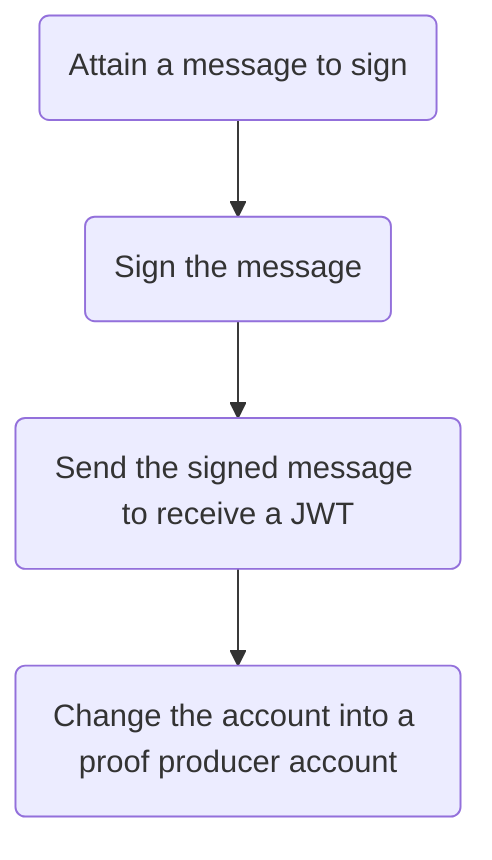

import ApiSchema from '@theme/ApiSchema';

# Registering as a new producer

This tutorial details how to register as a new proof producer.

## Overview

The following diagram shows the flow for registering as a new proof producer:

:::tip[Justification]

The sign up flow ensures security while allowing Proof Market usage for anyone with an ETH wallet. When an initial request is made, Proof Market issues a random message that can be signed off-chain without exposing the account private key. The request for a JWT only requires the account address and the signed message.

:::

## Performing the initial request

[**Consume the `/user/metamask/message`**](../../api-reference#operation/MetamaskAuthMessage) endpoint to produce the following response.

<ApiSchema pointer="#/components/schemas/MetamaskAuthMessage"/>

## Signing the message

At this point, the message needs to be signed for the result to be passed into the next request.

Signing the message can be done via [**the `eth_sign` method, the MetaMask `personal_sign` method**](https://docs.metamask.io/wallet/how-to/sign-data/#use-personal_sign) or any other suitable method or tool that produces a valid signature.

## Receiving a JWT

To receive a web token, perform a [**`POST` request with the `"msg"` received previously to `/user/metamask`**](../../api-reference#operation/MetamaskAuthRequest) with this request body:

<ApiSchema pointer="#/components/schemas/MetamaskAuthRequest"/>

The `"jwt"` field in the response will contain the token.

<ApiSchema pointer="#/components/schemas/AuthUser"/>

The token should be used in the `"authorization"` key in all subsequent response headers.

## Attaining the user info

To verify that a new user has been created successfully, make a [**`GET` call to `/user/info`**](../../api-reference#operation/Me). This should produce the below response:

<ApiSchema pointer="#/components/schemas/UserDetails"/>

## Changing the account status

The `"producer"` key in the previous response formally marks an account as a proof producer. 

If it equals 'false', [**consume the `/producer/register` endpoint**](../../api-reference#operation/Register) to change its value.

<ApiSchema pointer="#/components/schemas/RegisterProducerResponse"/>

To reverse this action, call [**the `/producer/deregister` endpoint**](../../api-reference#operation/Deregister).

