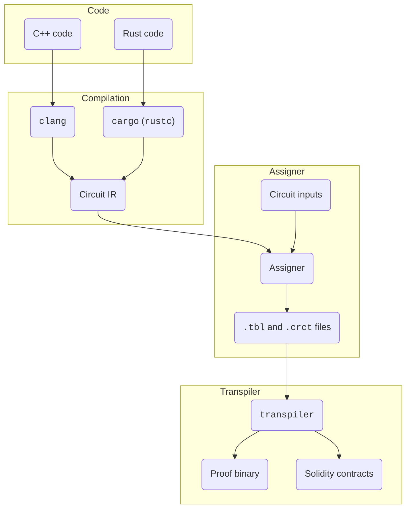

# Usage flow

## Diagram

The following diagram shows the flow for converting a `.cpp` or a `.rs` file into a proof binary and Solidity code for deployment.

## Key stages

Here is a breakdown of the key stages a circuit must pass before being proven.

### Write code in C++ or Rust

There is no need to use any special syntax when working with zkLLVM. A circuit is defined by simply adding a `[[circuit]]` (C++) or a `#[circuit]` (Rust) directive before a function. With some modifications, almost any existing C++ or Rust code can be reused for zkLLVM.

:::tip[Examples]

The [**zkLLVM repository**](https://github.com/NilFoundation/zkllvm) contains several ready-made examples of circuits. They can be reused wholly or repurposed depending on the use case.

:::

:::info[Limitations]

Read the materials in the **Best practices and limitations** section to learn more about the changes that would need to be made to existing C++ or Rust code for reuse in zkLLVM.

:::

### Compile the code into a circuit

Compiling takes only a few seconds and the entire process is done via a CLI tool which is a replacement for `clang` and `rustc`. This tool can be easily integrated to a CI/CD pipeline or any development environment.

It is also possible to use dedicated build management systems (Cargo and CMake) if a circuit requires the use of external dependencies.

### Pass the circuit to the `assigner` tool

The `assigner` tool is used to prepare all inputs and witnesses for the circuit. It generates the circuit constraints and the assignment table.

After this stage is complete, the circuit should be ready for use with dynamic inputs.

### Generate proof for the circuit

At this point, the circuit and its inputs can be passed to [**the `transpiler` tool**](../getting-started/compiling-a-circuit#using-transpiler-to-generate-the-circuit-proof) to generate a proof and Solidity contract files.

Alternatively, the circuit proof can be generated by [**using the `proof-generator` tool**](../getting-started/verifying-a-circuit#generate-a-proof-using-proof-producer).