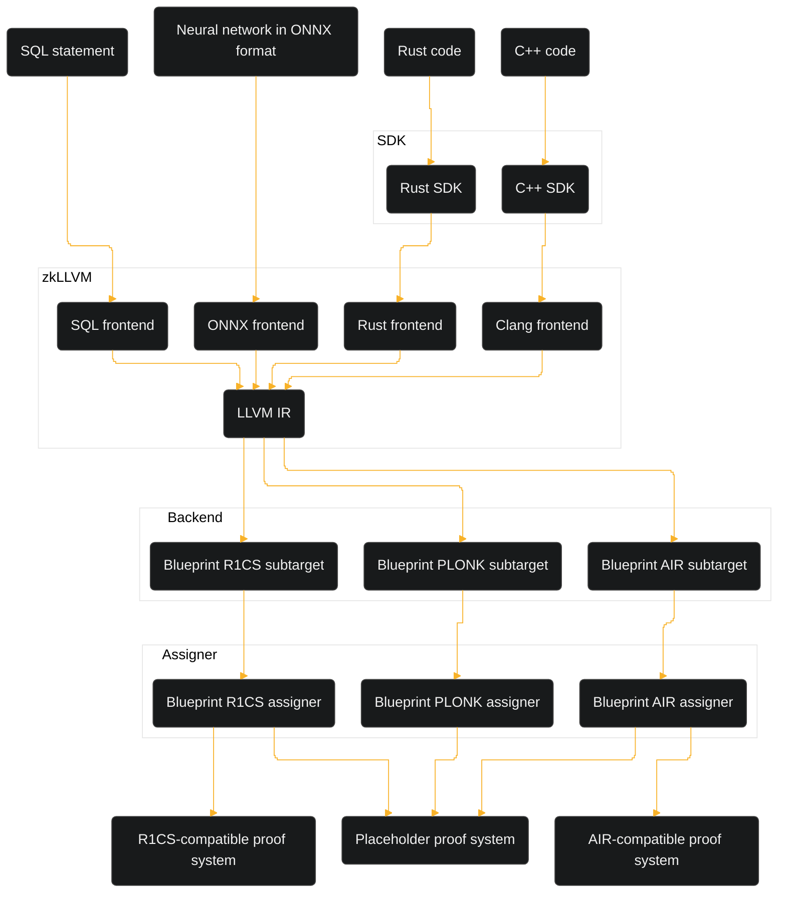

import GitHubButton from '@site/src/components/GitHubButton'

# What is zkLLVM?

## Definition

<GitHubButton Url='https://github.com/NilFoundation/zkllvm' />

zkLLVM is a compiler that transforms C++ or Rust code into circuits to be used in zk-SNARK or zk-STARK systems.

The goal of zkLLVM is to make zero-knowledge proofs and provable computations accessible for everyone with knowledge of C++ or Rust programming.

zkLLVM takes code, breaks it down into circuit components, and transforms it into an arithmetic constraint system that can be used to generate and verify proofs when given public and private inputs.

Circuits generated by zkLLVM are compatible with the [**Placeholder proof system**](https://nil.foundation/blog/post/placeholder-proofsystem). To learn more about how zkLLVM can be extended to other proof systems, [**click here**](./key-components-tools#assigner).

:::info[Placeholder proof system]

The Placeholder system is PLONKish. The circuit components for this system are supplied from =nil; Foundation's [**blueprint library**](https://github.com/NilFoundation/zkllvm-blueprint).

:::

:::tip[Recommended specs]

The following specs are recommended for working with zkLLVM.

- A Linux-based system (Ubuntu 20+ is preferable)
- At least 16 GBs of RAM

If you are using a Windows machine, an Ubuntu distribution can be accessed via [**the WSL 2 service**](https://learn.microsoft.com/en-us/windows/wsl/install).

:::

## Pipeline

The following diagram outlines the key components and stages of the zkLLVM circuit generation pipeline. Note that some of these components are currently unsupported.

For a more detailed explanation of transforming code into a provable circuit and generating proof for it, [**click here**](./usage-flow).

